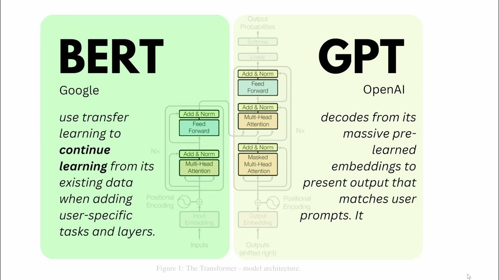

# BERT Transformer Learning Journey

## Introduction

Welcome to my BERT Transformer Learning Journey! In this repository, I am documenting my process of learning about the BERT (Bidirectional Encoder Representations from Transformers) model and its application in natural language processing tasks. My ultimate goal is to build a Language Model using the PyTorch framework, starting from scratch. I am also delving into intuitive mathematics to gain a deeper understanding of the underlying concepts.

## Current Progress

So, Far I have Learned input embedding, positional embedding, Mult-Head Self-Attention, layer Normalization every process on how BERT Encoder and it's decoder works . Now proceeding towards Masked Language Modeling (MLM) of BERT in Game of Throne book dataset.
First Appraoch:
- MLM the BERT-large model in GOT text data
- Prepare a Question/Answering data in SQuAD format to train the model for Question /Answering
## Repository Structure

- `code/`: This directory contains the Python code for implementing BERT using PyTorch. I am breaking down the implementation into manageable modules to better understand each component.

- `notebooks/`: Here, I am documenting my progress through Jupyter notebooks. Each notebook covers a specific aspect of the learning process and includes both code and explanations.

- `resources/`: I am collecting relevant research papers, blog posts, tutorials, and other useful materials in this directory. This will help me deepen my understanding and keep track of the resources I've found valuable.

- `images/`: I've gathered visual aids and diagrams related to the BERT model and its components. These visuals aid in comprehending complex concepts.

## Learning Approach

I am taking a comprehensive approach to learning, which includes:

1. **Understanding Transformer Architecture**: Before diving into BERT, I am ensuring a solid grasp of the core transformer architecture, which forms the basis for BERT.
2. **Understanding Embedding Algorithms**: Begin by delving into the fundamentals of word embeddings, such as Word2Vec, GloVe, and FastText. Understand how these algorithms map words or subwords to continuous vector spaces.
3. **Deep Dive into Self-Attention Mechanisms**: Implement self-attention mechanisms from scratch to gain a hands-on understanding of their inner workings. 

4. **Learning BERT Intuitively**: I believe that a deeper understanding of the mathematics behind BERT is essential. I am dedicating time to study intuitive math concepts related to linear algebra and attention mechanisms.

5. **Hands-on Implementation**: Alongside theory, I am actively implementing BERT using PyTorch. This hands-on approach helps me solidify my understanding and overcome implementation challenges.

6. **Building a Language Model**: Once I'm confident with BERT, I will extend my knowledge to construct a Language Model using the principles I've learned.

## Future Steps

- Complete the implementation of BERT using PyTorch.
- Deepen my understanding of intuitive mathematics related to transformers.
- Begin working on the Language Model using the knowledge gained from BERT.

## Get Involved

If you're also interested in BERT, transformers, PyTorch, or intuitive math, feel free to fork this repository and join me on this learning journey. Contributions, suggestions, and collaborations are highly appreciated!

## Contact

You can reach me at [hamaljyotsan@gmail.com](mailto:hamaljyotsan@gmail.com) for any questions, suggestions, or discussions related to this project.

---

**Today's Date**: 2023-08-31

**Interest in Research Paper**: As my understanding deepens, I am considering the possibility of writing a research paper in the future, focusing on a specific aspect of BERT or its application. This would be a culmination of my learning journey and a contribution to the NLP research community.

Thank you for joining me on this exciting journey of learning, implementation, and exploration!

